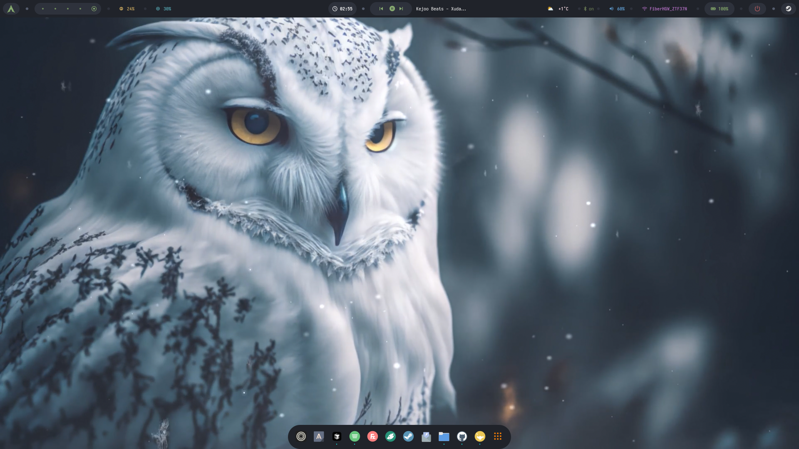

# Dotfiles Install

```
git clone https://github.com/SiberizmDev/HyprNord.git
```

```cd HyprNord```

install it manually:


Let's start with a backup. To receive using a terminal:

```
cp -r ~/.config ~/.config.bak
cp -r ~/.icons ~/.icons.bak
cp -r ~/.fonts ~/.fonts.bak
cp -r ~/.themes ~/.themes.bak
cp -r ~/.zshrc ~/.zshrc.bak
cp -r ~/.aliases ~/.aliases.bak
```

Or take a manual backup:


- Don't lose your configuration:

Go to the `/home/user/` directory and copy the `.config` folder and paste it without leaving the same directory. Change the name of the pasted folder to `.config.bak`


- Don't lose your icons:

Go to the `/home/user/` directory and copy the `.icons` folder and paste it without leaving the same directory. Change the name of the pasted folder to `.icons.bak`


- Don't lose your fonts:

Go to the `/home/user/` directory and copy the `.fonts` folder and paste it without leaving the same directory. Change the name of the pasted folder to `.fonts.bak`


- Don't lose your themes:

Go to the `/home/user/` directory and copy the `.themes` folder and paste it without leaving the same directory. Change the name of the pasted folder to `.themes.bak`


Now let's back up our files:


- Don't lose your ZSH configuration:

Go to the `/home/user/` directory and copy and paste the `.zshrc` file without leaving the same directory. Change the name of the pasted file to `.zshrc.bak`


- Aliases are a file specially prepared for me. Most likely you do not have this file. If so, follow this step:

Go to the `/home/user/` directory and copy and paste the `.aliases` file without leaving the same directory. Change the name of the pasted file to `.aliases.bak`


Pay attention to the file and folder names I wrote. If the name of your configuration files is not currently written, you do not have any previous configuration. You don't need to make backups for these.

For example, I have a file named `.aliases`. This file does not have to be available to everyone. You don't need to force a backup for this.


# Required Softwares

Let's install our software:

```
[Arch Linux]
yay -S nm-connection-editor cava mpd mpv vlc okular libreoffice-fresh hyprland waybar anytype grimblast sddm brightnessctl playerctl hyprlock pamixer rofi-wayland wlogout hyprswitch rustup nwg-dock nwg-drawer wf-recorder btop zsh oh-my-zsh-powerline-theme-git ark unrar zip unzip pavucontrol pavucontrol-qt xdg-desktop-portal-wlr neovim vim nano git wget mpvpaper dunst nemo kvantum kvantum-qt5 kate appimagelauncher-bin noto-fonts-emoji wl-clipboard xfce4-appfinder wofi catfish zen-browser kitty polkit-gnome gnome-keyring ntfs-3g cliphist qt5ct qt5 qt6 qt6ct plasma lxappearance tesseract-data-tur tesseract-data-eng tesseract-data-rus visual-studio-code-bin jdk-openjdk discord ferdium-bin bitwarden flatpak gimp meld krita kitty kdenlive inkscape konsole neofetch go python-pip hyprpicker syncthing filezilla spotify qbittorrent obs-studio wine wlogout ente-auth-bin kdeconnect thunderbird rofimoji localsend-bin apache php php-apache phpmyadmin mariadb
```

# Install PHP Server

## HTTPD Edit

```
sudo nvim /etc/httpd/conf/httpd.conf
```

- Paste:

```
LoadModule php_module modules/libphp.so
AddHandler php-script php
Include conf/extra/php_module.conf
Include conf/extra/phpmyadmin.conf
```

- And add Comment:

```
#LoadModule mpm_event_module modules/mod_mpm_event.so
```

- Remove Comment:

```
LoadModule mpm_prefork_module modules/mod_mpm_prefork.so
```

- Create PHPMyAdmin File:

```
sudo nvim /etc/httpd/conf/extra/phpmyadmin.conf
```

- Add Lines:

```
Alias /phpmyadmin "/usr/share/webapps/phpMyAdmin"

<Directory "/usr/share/webapps/phpMyAdmin">
    DirectoryIndex index.php
    AllowOverride All
    Options FollowSymlinks
    Require all granted
</Directory>

<Directory "/etc/webapps/phpMyAdmin">
    Require all granted
</Directory>

```

- Edit php.ini:

```
sudo nvim /etc/php/php.ini
```

- Remove Comment:

```
extension=mysqli
```

## Install MariaDB

```
sudo systemctl start httpd
sudo systemctl enable httpd
sudo chown -R mysql:mysql /var/lib/mysql
sudo mysql_install_db --user=mysql --basedir=/usr --datadir=/var/lib/mysql
sudo systemctl start mariadb
sudo systemctl enable mariadb
sudo mysql_secure_installation
```

## Permission

```
sudo chmod -R 777 /srv
```


# Optional Softwares

```
[All Distros]
flatpak install stremio flatseal obsproject atom
```

# Change Flatpak Apps Theme

```
sudo flatpak override --filesystem=$HOME/.themes
sudo flatpak override --filesystem=$HOME/.icons
sudo flatpak override --env=GTK_THEME=Dracula-GTK
sudo flatpak override --env=ICON_THEME=Dracula
```

# Change System Theme

- This process is required to activate qt6ct in the system and to apply the GTK Theme. We can start editing the environment side by typing the command `sudo nano /etc/environment`

```
...
GTK_THEME=Dracula-GTK
QT_QPA_PLATFORMTHEME=qt6ct
...
```
# Change Shell

```
sudo chsh -s $(which zsh)
chsh -s $(which zsh)
```

# Screenshot Desktop


